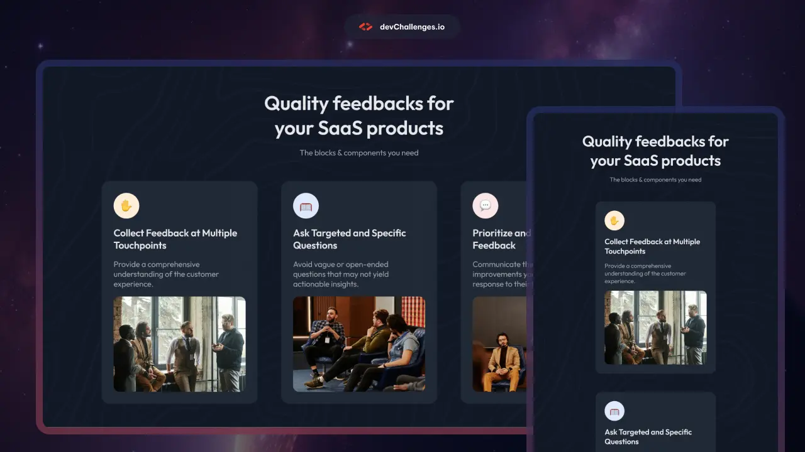
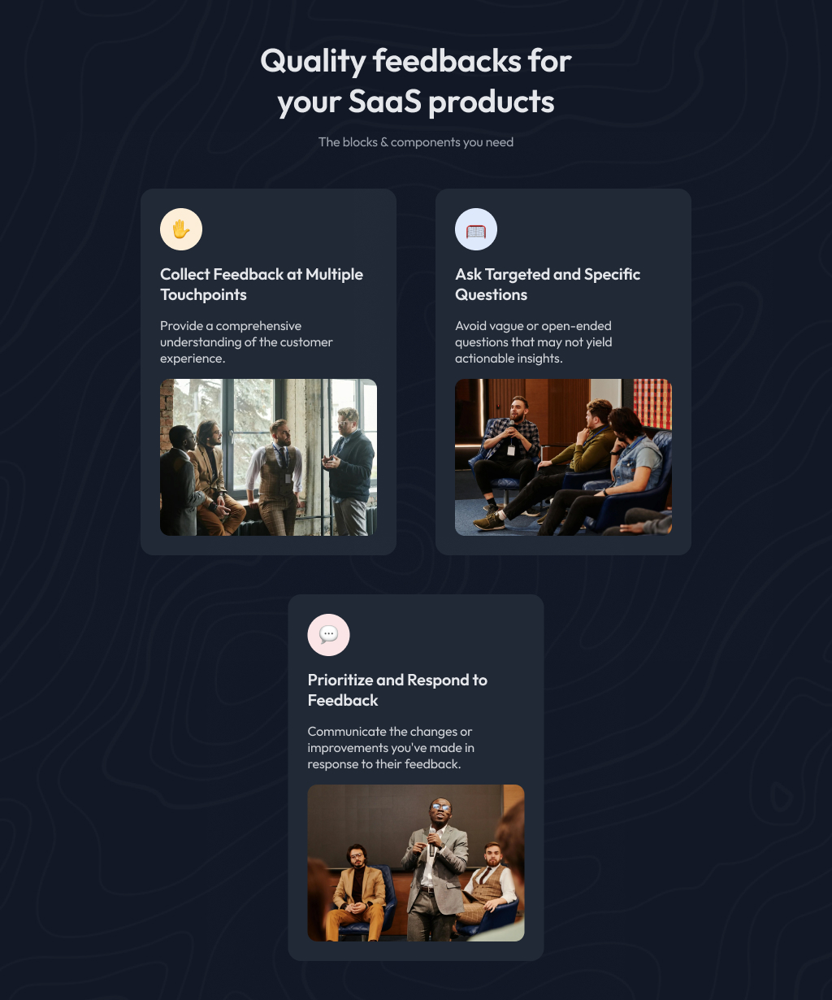
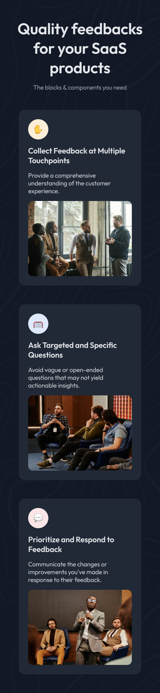

# DevChallenges.io - Simple Feature Section

  

## 📋 Overview

This project is a pixel-perfect solution to the [Simple Article Listing](https://devchallenges.io/challenge/simple-feature-section-challenge) challenge from [devChallenges.io](https://devchallenges.io/). The goal was to create a fully responsive, accessible, and visually accurate article listing page using only HTML and CSS, closely matching the provided design for all screen sizes.

| Desktop | Tablet | Mobile |
| ------- | ------ | ------ |
|  |  |  |

## 🚀 Features

- Fully responsive web page that displays on different devices and screen sizes.
- Clean, semantic, accessible webpage and user-friendly
- Standard mobile first design practice
- Optimized local images for fast loading
- No frameworks

## 🛠️ Built With

- HTML5
- CSS3 (no frameworks)

## 📦 Getting Started

1. Clone or download this repository.
2. Open `index.html` in your browser.
3. All assets are local; no build step is required.

## 🧠 What I Learned

- How to compress local images from `.jpeg` to `webp` to optimize web perfomance and loading speed
- Advanced responsive layout techniques with flexbox and media queries
- In creating the web page for tablet devices, i had to use the `flex` properties: `flex-grow` to make a flexible item to grow, `flex-shrink` to make a flex item shrink or reduce and `flex-basis`, this is the set size for the item, before it grows or shrink the flex-basis should be set. This enabled me to make the last card stand alone.

## 🙏 Acknowledgements

- [devChallenges.io](https://devchallenges.io/) for the challenge and assets
- [Squoosh](https://squoosh.app/) to compress and convert images

